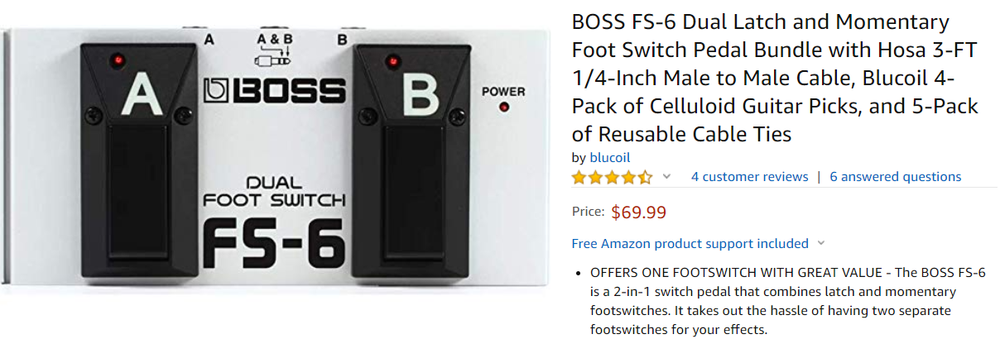

# ESP32_Footswitches

*_An ESP32 provides cheap home-built foot switches for my Roland Cube 40XL amplifier._*

_Pete Wentworth_    mailto:cspwcspw@gmail.com  

## Overview

Here you'll find a [great promotional demo](https://www.youtube.com/watch?v=m5H6hk8yA-s) 
of Alex Hutchinson 
introducing the Cube 40XL guitar amp. He makes good 
use of the foot switches to select the six externally 
controllable features. Roland recommend using three 
Boss FS-6 dual foot switches (with a battery in each). 
That will set you back more than $200 on Amazon. 



Instead, we'll control the six switch functions directly from
GPIO lines on an ESP32. Once we have software that can
switch each amp function on or off, we can experiment with
different input controllers to our ESP32: our own switches,
of some kind, or software configurations, touch screen, 
commands over USB, WiFi or Bluetooth, etc.

I'll show a simple controller later: a
very low-end and cheap implementation. Probably not 
the right thing for your concert in Hyde Park,
but good enough for home use. 

## Can we switch the amplifier functions from an ESP32?

There are three stereo jack sockets in the back of the amp,
and a matching stereo socket in each FS-6 dual footswitch.

The amp logic is similar to a GPIO pin with INPUT_PULLUP mode
set: the amp pulls each of the lines to 3.3v. The line level
activates or deactivates the function or mode of the amp.
For example, if we let the SOLO line float high, the amp switches
into SOLO mode. If we ground the line, SOLO mode disengages, 
and the amp reverts to whatever is set on the panel.  So the 
first step is a minimal ESP32 "blink" sketch that verifies we can 
toggle SOLO mode, and see the LED on the amp blinking:

```
// Wiring: Connect the GND pin of the ESP32 to the ground pin 
// (shaft) of a stereo jack plug.  Then connect GPIO 18 to the 
// RING on the jack plug. Plug into the SOLO foot switch socket.

#define SoloPin  18      // GPIO pin to control SOLO function 
void setup() { }

void loop() {
   // Simulate closing the footswitch by pulling the line low.
   // This deactivates SOLO mode on the amp. 
   pinMode(SoloPin, OUTPUT);
   digitalWrite(SoloPin, LOW);
   delay(1000);

   // Simulate opening the foot switch by putting the line 
   // into high impedance state. The amp will pull it up  
   // and SOLO mode will be turned on.
   pinMode(SoloPin, INPUT);
   delay(3000); 
}

```
So this step is successful.  I've managed to turn my guitar
amplifier into a blinking LED.
  
## Latching or instantaneous functions?

Some functions, like SOLO or REVERB work best with a 
latching switch.  That means you press and release
the foot switch, and REVERB turns on.  Next time you 
press and release the foot switch, REVERB turns off.

Other effects may be better with an instantaneous 
foot switch: the effect is only active while you keep
the switch pressed down.  Some timing and delay 
functions work well like this. 

Each switch on the Boss FS-6 footswich can be selected to 
be either instantaneous or latching. 

For us to get the same effect in software is easy. If 
we have a push button switch with no mechanical 
latching (e.g. a door bell switch or a mouse button), 
we will detect and respond to the two different transitions -
__switchClosed__ and __switchOpened__. 

The software here is organized in 
three components: a class for 
managing an output line to the
amp, and a class for handling an 
input (a switch, a mouse button, 
a touch controller, etc), and the main controller loop
that instantiates the input and output objects and 
determines the cross-connects between inputs and outputs,
and passes event messages between the components. 

One design decision is where to 
locate this "latching" memory in our ESP32 
software.  It seems that it is the line that needs to
latch (as opposed to a mechanical latching switch like a 
bedside lamp), so in this software latching is the 
responsibility of the output line driver component. 

## A six-switch pedalboard, version 1

I bought a handful of proximity touch sensor switches 
from Banggood, typically about $9 for 20 switches.  


The ones I have "learn" their capacitance when they are first
powered on, and then detect when a finger gets close enough.
Interestingly too, they can work as latching or instantaneous
switches, but it involves cutting a track on the board to 
change function. These ones also have little on-board LEDs that
light when the switch is triggered. I 
left mine all instantaneous, and will deal
with latching in the software. They can sense touch through or
behind a non-conductive cover plate of a couple of millimeters 
of perspex, glass, wood, etc., so in principle, we should be able
to make the front our our pedal board look great.

The board itself was a discarded piece of shelf wood.  I cut some
really ugly recesses in the front so that the six switches would
sit flush with the top wood surface, drilled holes through for the
wiring. 


I routed some channels in the back of the board for 
wiring. 


Each sensor needs Vcc, Ground, and has an output line which goes
high or low. The Vcc and Ground pins can all be wired on
a common bus.  So in total I needed an 8-wire cable from the board
back to the ESP32: six switch outputs, Vcc, and Ground. Ethernet 
cable has 8-cores, and I had some lying around. So here is the 
wiring harness being put in place:  


And here we have the first few switches soldered in place in front.


## Conclusion

Ideally we need some pretty trim on the front to make it look better, 
and we could screw an extra piece of plywood over the wiring at
the back (even adding some nice rubber feet).  We might even want
to move the ESP32 and a power source down into a recess in the back
of the board. So far I've not done that.

The switches are a bit problematic because rubber soles
may not provide a reliable trigger. So perhaps 
this design works best for bare-footed guitarists. Obviously
we can replace them with other switches or proximity sensors - 
I have a handful of TLP909 proximity sensors somewhere that 
are candidates.  They have an infrared emitter and an 
infrared detector, and are triggered by photoreflectivity.
Typically they are used in photocopiers to detect paper. 
So provided your shoe soles are white, you should be fine.

*Last Revision 26 September 2019*  
mailto:cspwcspw@gmail.com 


